# Kultra-Mega-Stores-Inventory-Analysis

This project was completed as part of the Data Analysis Training Program by IncubatorHub under the Digital SkillUp Africa (DSA) initiative.
It demonstrates the use of SQL and Excel to solve real-world business problems using historical sales and customer data from Kultra Mega Stores.
The case study focuses on evaluating sales performance in the Abuja division between 2009 and 2012. As an aspiring Business Intelligence Analyst, I analyzed the data to uncover key insights, solve case scenarios, and provide actionable recommendations as part of my final training project.

## Project Objectives
**This project aimed to:** <br>
- Analyze historical sales data for Kultra Mega Stores’ Abuja division (2009–2012)
- Solve the given case scenarios using SQL-based analysis To:
    - Identify top-performing product categories and customer segments.
    - Evaluate order trends, profit margins, and shipping costs.
    - Uncover additional insights and provide recommendations to the business manager for improving revenue. <br>
## Tools /Technique Used
- Microsoft Excel 2016 - EDA
- SQL server, SSMS - Analysis & case scenario 

## Dataset Description
The dataset contains historical order records from Kultra Mega Stores' Abuja division covering the period 2009 to 2012. It includes details of product sales, customer segments, shipping details, and financial metrics. Each row represents a unique order transaction.<br>

*Key columns in the dataset include:* <br>
- Order Date – The date an order was placed.
- Region – Geographical location of the order
- Customer Segment – Type of customer ( Consumer, Corporate, Small Business).
- Product Category & Sub-Category – The main and sub-group of the ordered product.
- Product Name – The specific item sold.
- Order Priority – Indicates the urgency (High, Medium, Low, Not Specified).
- Sales – Total revenue generated from the order.
- Quantity – Number of units sold.
- Discount – Percentage discount applied to the order.
- Profit – Net profit from the order.
- Shipping Cost – Cost incurred for delivering the product. <br>
This dataset enables analysis of sales trends, product performance, customer behavior, and operational efficiency<br>
## Exploratory Data Analysis (EDA)
The exploratory data analysis was conducted using SQL to uncover initial insights from the Kultra Mega Stores order dataset (2009–2012). The goal was to understand the structure, quality, and distribution of key business variables such as product categories, order trends, customer segments, and profit metrics. <br>

**Key findings include:** <br>

**Data Structure & Quality Checks:**<br>
The dataset contains order-level data with fields such as Order Date, Product Category, Customer Segment, Profit, Sales, Shipping Cost, Region, and Order Priority. Basic cleaning revealed:<br>

**Some rows had missing values or unspecified order priorities.**
A few entries contained negative profits, possibly due to returns or high shipping costs.
Inconsistent date formats (some with only the year) were also noted.<br>

**Sales & Profit Overview:**<br>
Total sales and profit are aggregated by year, category, and region.
Some categories generated the highest revenue, while some Furniture items showed lower or negative profit margins.<br>

**Customer Segmentation:**<br>
Customers were segmented into Consumer, Corporate, and Home Office groups. Corporate clients contributed significantly to total sales. <br><br>

## Analysis Tasks
After completing the Exploratory Data Analysis (EDA), additional analysis was performed directly on the database using SQL within SQL Server Management Studio (SSMS) to address the following scenarios. 

**A. first i created a database**
```
---- Database for the project: DSA_Capstone_Project_db
create database DSA_Capstone_Project_db
```
**B. Insert the given tables** <br>
- [dbo].[KMS_Case_Study]
- [dbo].[Order_Status]

## CASE SCANARIO I <br>

### 1. Product category with the highest sales = Technology
```
SELECT Top 1 Product_Category, Round(SUM(Sales),2) AS Total_Sales
FROM kms_Case_Study
GROUP BY Product_Category
ORDER BY Total_Sales DESC
```
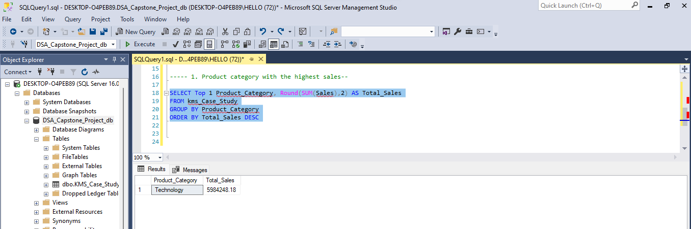 <br><br>

### 2. What are the Top 3 and Bottom 3 regions in terms of sales? <br>
```
----- TOP 3 REGION IN TERMS OF SALES

SELECT Top 3 Region, Round(SUM(Sales),2) AS Total_Sales
FROM kms_Case_Study
GROUP BY Region
ORDER BY Total_Sales DESC

-- -Bottom 3 regions by sales--

SELECT Region, ROUND(SUM(Sales),2) AS TotalSales
FROM KMS_Case_Study
GROUP BY Region
ORDER BY TotalSales ASC
OFFSET 0 ROWS FETCH NEXT 3 ROWS ONLY
```
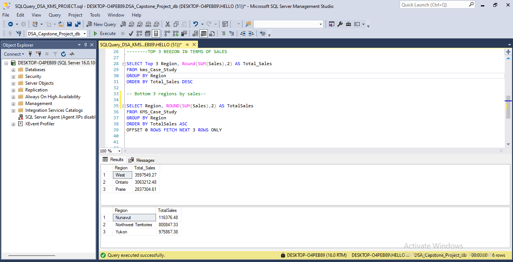 <br><br>
### 3. The total sales of appliances in Ontario
```
----3. The total sales of appliances in Ontario----
SELECT Region, ROUND(Sum(sales),2) as Total_Sales_Appliances
FROM KMS_Case_Study
where region ='ontario' and Product_sub_category = 'Appliances'
group by region
```
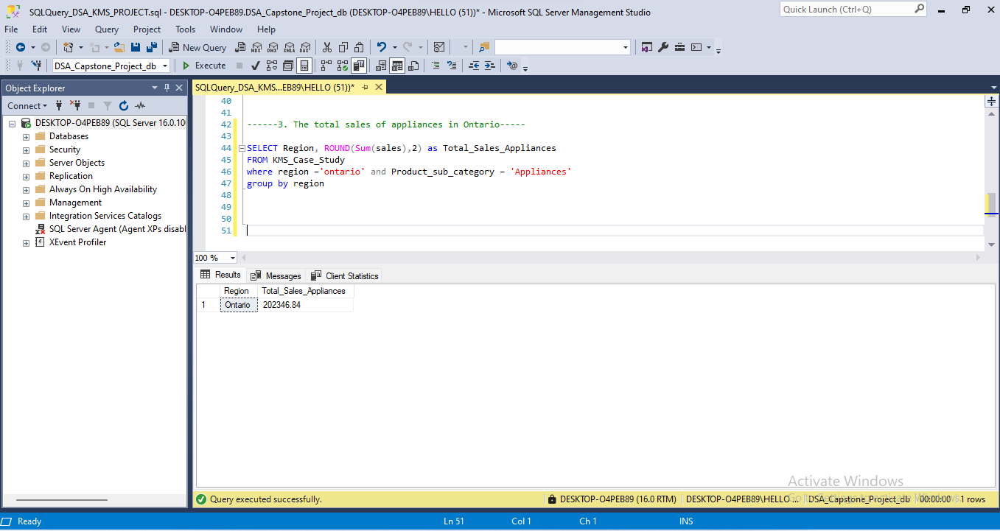<br><br>

### 4. Advise the management of KMS on what to do to increase the revenue from the bottom 10 customers
```
SELECT TOP 10 Customer_Name, ROUND(SUM(sales),2) AS total_sales
FROM KMS_Case_Study
GROUP BY Customer_Name
ORDER BY total_sales ASC
```
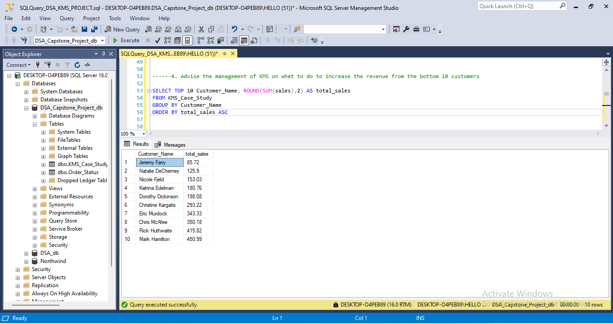<br><br>

#### Advise the management on what to do to increase the revenue from the bottom 10 customers <br>
- Introduce special discounts, bundles, or loyalty rewards to encourage higher and repeat purchases.
- Recommend profitable and complementary items based on their previous orders to increase order value.
- Ensure they receive timely deliveries and excellent service—this can build trust and drive loyalty.
- Reach out for feedback or run a quick survey to learn what might be limiting their spending, then act on it.<br><br>


### 5. KMS incurred the most shipping cost using which shipping method?


```
-----5. KMS incurred the most shipping cost using which shipping method?--

SELECT top 1 Ship_Mode, ROUND(SUM(Shipping_Cost),2) AS Total_Shipping_Cost
FROM KMS_Case_Study
GROUP BY Ship_Mode
ORDER BY Total_Shipping_Cost DESC
-----ANS: KMS incurred the most shipping cost using delivery truck--
```
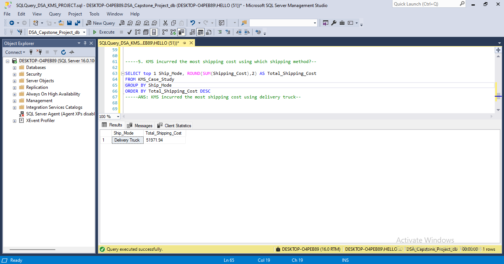<br><br>

## Case Scenario II

### 6 most Valuble customers, products OR service they purchase

```
--------6a most Valuble customers 
SELECT top 5 Row_ID, Customer_Name, ROUND(SUM(Sales),2) AS TotalSpent
FROM KMS_Case_Study
GROUP BY Row_ID, Customer_Name
ORDER BY TotalSpent DESC

----6b products OR service they purchase--------

SELECT TOP 5 [Customer_Name], [Product_Name],
ROUND(SUM(Sales),2) AS Total_Sales
FROM KMS_Case_Study
GROUP BY [Customer_Name], [Product_Name]
ORDER BY Total_Sales DESC
```
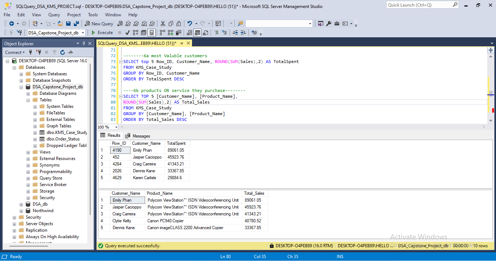<br><br>

### Q7: Highest sales among Small Business customers <br>
```
----Q7: Highest sales among Small Business customers

SELECT TOP 1 Customer_Name, ROUND(SUM(Sales),2) AS Total_Sales
FROM KMS_Case_Study
WHERE Customer_Segment = 'Small Business'
GROUP BY Customer_Name
ORDER BY Total_Sales DESC
```
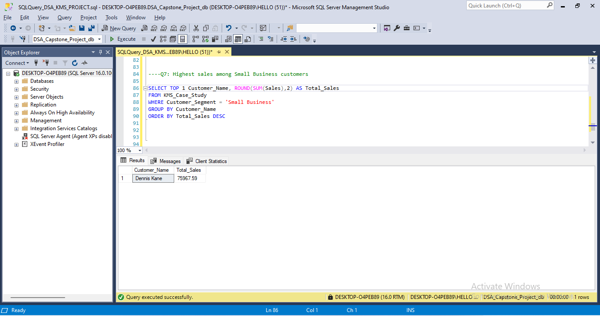<br><br>
##$ Q8: Corporate Customer that placed the most number of orders in 2009 – 2012
```
----Q8: Corporate Customer that placed the most number of orders in 2009 – 2012

SELECT top 1 Customer_Name, COUNT(Order_ID) AS Order_Count
FROM KMS_Case_Study
WHERE Customer_Segment = 'Corporate'
GROUP BY Customer_Name
ORDER BY Order_Count DESC
```
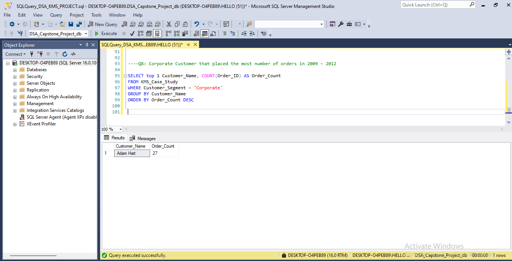<br><br>
### Q9: Most profitable consumer customer
```
---Q9: Most profitable consumer customer

SELECT top 1 Customer_Name, round(SUM(Profit),2) AS Total_Profit
FROM KMS_Case_Study
WHERE Customer_Segment = 'Consumer'
GROUP BY Customer_Name
ORDER BY Total_Profit DESC
```
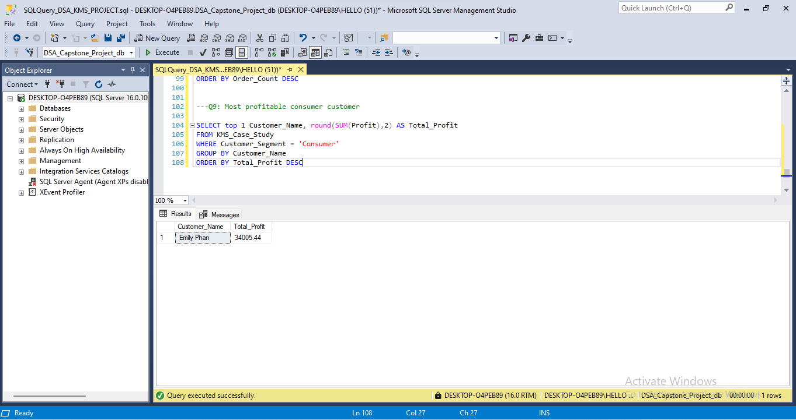<br><br>
### 10  customer  that returned items, and segment they belong to<br>

```
----10  customer  that returned items, and segment they belong to
SELECT DISTINCT o.[Order_ID], o.[Customer_Name], o.[Customer_Segment]
FROM [dbo].[KMS_Case_Study] o
JOIN [dbo].[Order_Status] r
ON o.[Order_ID] = r.[Order_ID]
WHERE r.Status = 'Returned'
```
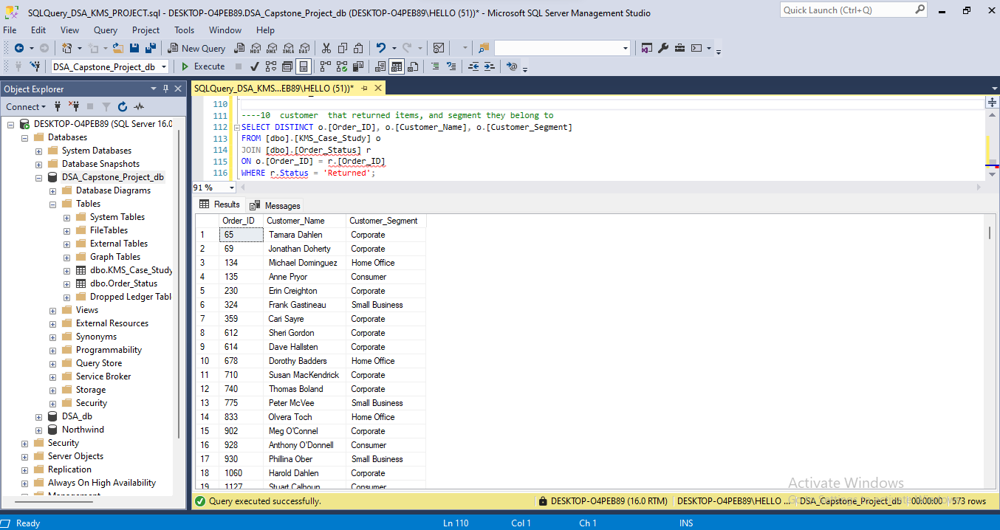<br><br>

### 11 If the delivery truck is the most economical but the slowest shipping method and Express Air is the fastest but the most expensive one, do you think the company appropriately spent shipping costs based on the Order Priority? Explain your answer <br>


------ 11 If the delivery truck is the most economical but the slowest shipping method and Express Air is the fastest but the most expensive one, do you think the company appropriately spent shipping costs based on the Order Priority? Explain your answer

```
SELECT
    [Order_Priority],
    [Ship_Mode],
    COUNT([Order_ID]) AS order_count,
    Round(SUM(sales - profit),2) AS estimated_shipping_cost,
    AVG(DATEDIFF(DAY, [Order_Date], [Ship_Date])) AS avg_ship_days
FROM
    KMS_Case_Study
GROUP BY
    [Order_Priority], [Ship_Mode]
ORDER BY
    [Order_Priority], [Ship_Mode] Desc

---NO the company didnt spent shipping cost base on order priority, delivery trucks where used for some critical and high oder priority which may lead to delay of delivery and customers disatisfaction. EPRESS AIR mode ship mode was used for low and not specified order priority whichresult in unneccessary high cost. may lead to lost of profit and revenue.
```
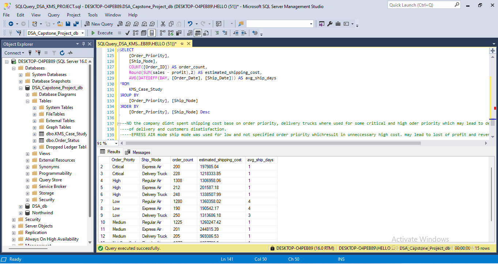<br>

***NO. The company didnt spent shipping cost base on order priority, delivery trucks where used for some critical and high oder priority which may lead to delay of delivery and customers disatisfaction. EPRESS AIR mode ship mode was used for low and not specified order priority whichresult in unneccessary high cost. may lead to lost of profit and revenue.***
